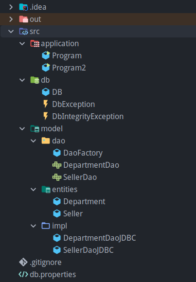

# JDBC DAO Project

## Overview

This Java project demonstrates the implementation of the Data Access Object (DAO) design pattern to manage database operations using JDBC. The project focuses on handling operations for sellers and their respective departments, including creating, reading, updating, deleting, and listing records.

## Features

- **CRUD Operations**:
    - Perform Create, Read, Update, and Delete operations on sellers and departments.
- **List and Find** :
    - List all sellers and departments, and find specific records based on their department or id.
- **Separation of Concerns**:
    - Utilizes the DAO design pattern to separate the data access logic from the business logic, promoting a cleaner and more maintainable code-base.

## Project Structure



## Structure overview

- **Pacote db:**
    - **`DB`** class: Responsible for connecting and disconnecting the database and load properties.
    - **`DbException`** and **`DbIntegrityException`**: Custom exception handling.
- **Model Classes**: Divided in three parts:
    1. **DAO (Interfaces)**: Define the standard operations for data access.
        - `DaoFactory`: Responsible for creating instances of DAO implementations.
        - `SellerDAO`: Interface for seller-related database operations.
        - `DepartmentDAO`: Interface for department-related database operations.
    2. **Entities**:
        - `Seller`: Represents a seller with attributes like ID, name, email, etc.
        - `Department`: Represents a department with attributes like ID and name.
    
    1. **DAO Implementations**: Implement the DAO interfaces using JDBC.
        - `SellerDaoJDBC`: Implements `SellerDAO` to interact with the seller table.
        - `DepartmentDaoJDBC`: Implements `DepartmentDAO` to interact with the department table.

## Prerequisites

- **Java Development Kit (JDK)**: Version 8 or higher.
- **Database**: MySQL or any other relational database.
- **IDE**: IntelliJ IDEA, Eclipse, or any other preferred IDE.

## Setup

1. **Clone the Repository**:

```bash
git clone https://github.com/your-username/jdbc-dao-project.git
```

1. **Configure the Database**:
    - Configure the connection by accessing this link: https://github.com/kauahaymon/java-database1
    - Update the JDBC connection settings in the `db.properties` file.
2. **Build and Run the Project**:
    - Use your IDE to build and run the project.
    - Or use the command line:
        - To compile `Program.java`:
            
            ```bash
            cd demo-dao-jdbc/application
            javac -cp .:../lib/jdbc-driver.jar Program.java
            ```
            
            - To execute:
                
                ```bash
                java -cp .:../lib/jdbc-driver.jar Program
                ```
                
        - To compile `Program2.java`:
            
            ```bash
            cd demo-dao-jdbc/application
            javac -cp .:../lib/jdbc-driver.jar Program2.java
            ```
            
            - To execute:
                
                ```bash
                java -cp .:../lib/jdbc-driver.jar Program2
                ```
                

## Contributing

Contributions are welcome! Please open an issue or submit a pull request for any improvements or new features.

## License

This project is licensed under the MIT License. See the [LICENSE](LICENSE) file for details.
